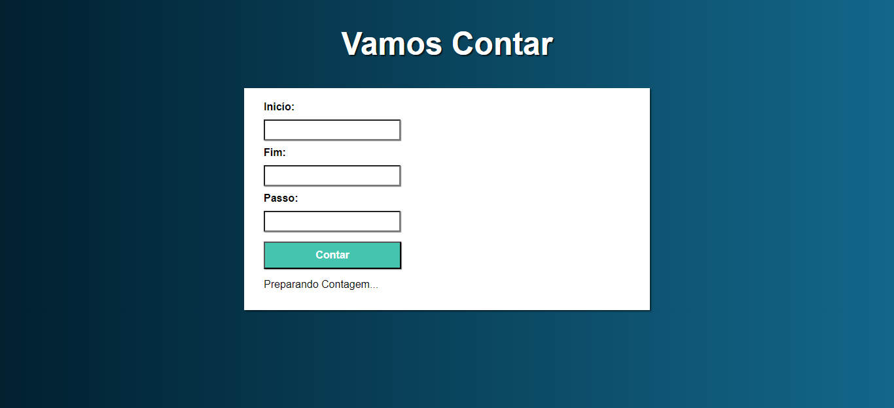

<h1>Contador</h1>

    Este projeto se trata de um Contador feito com JavaScript que conta os números em ordem crescente e decrescente.

<h2>Tecnologias utilizadas para criação do projeto</h2>

<ul>
    <li>HTML5
    <li>CSS3
    <li>JavaScript
</ul>

<h2>Responsividade</h2>

    Para este projeto eu usei a metodologia mobile first e tornei o projeto adaptável para diferentes tamanhos de telas.

